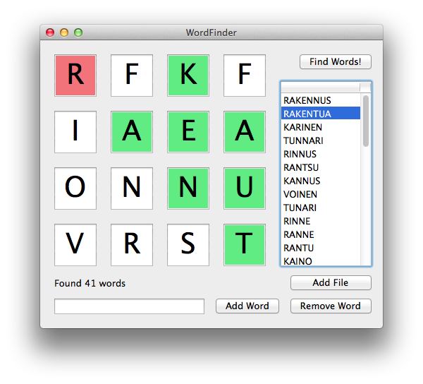

WordFinder
==========

Simple tool for finding solutions for Wordz! -game (sanajahti in finnish)

Written in Objective-C, Mac OS X only.

Import words in a plaintext .txt file. File must contain one word per line.
The file should contain all words in a language, so it's basically a list of words in a dictionary.

NOTE: using this tool for actual playing may result in being banned from games

